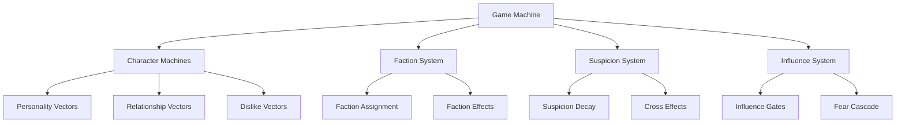

# Harem Empire - Advanced Features Design Document

## Overview

This design document outlines the architecture for advanced political intrigue mechanics that build upon the existing core game system. The enhancements focus on creating a more dynamic, strategic, and replayable experience through sophisticated risk/reward systems, faction mechanics, and emergent political dynamics.

The design leverages the existing XState-based architecture with character machines and maintains the current vector-based personality and relationship system while extending it with new mechanics for suspicion decay, influence-based restrictions, faction formation, and cross-character effects.

## Architecture

### Core Design Principles

1. **Incremental Enhancement**: Build upon existing systems without breaking current functionality
2. **Vector-Based Dynamics**: Extend the current personality/relationship vector system for new mechanics
3. **Emergent Complexity**: Simple rules that create complex political scenarios
4. **Performance Conscious**: Minimize computational overhead for cross-character calculations
5. **Modular Implementation**: Each feature can be implemented and tested independently

### System Architecture Overview



## Components and Interfaces

### 0. Core Function Migration Components (Prerequisites)

Before implementing the advanced features, the following core systems must be migrated and fully functional:

#### Character Stats Display System
```typescript
interface CharacterStatsDisplay {
  // UI component for displaying character statistics
  renderStatsDisplay(character: Character, canShowStats: boolean): string;
  getSuspicionColor(suspicion: number): string;
  
  // Stats formatting with proper styling
  formatRelationshipStats(trust: number, loyalty: number, fear: number, dependence: number): string;
  formatPersonalityStats(ambition: number, empireLoyal: number, influence: number, suspicion: number): string;
}
```

#### Player Vector and Reputation System
```typescript
interface PlayerVectorSystem {
  // Player character development
  updatePlayerVector(actionType: 'ambitious' | 'loyal' | 'cautious', character: Character): void;
  
  // Trust-based relationship bonuses
  getTrustCompoundBonus(character: Character): number; // 1.8x, 1.4x, 1.2x, or 1.0x
  
  // Emperor interaction mechanics
  giveEmperorGifts(): void; // Requires 10 gifts or perceivedLoyalty > 0.8
}

interface PlayerReputation {
  perceivedThreat: number;
  perceivedLoyalty: number;
  trustworthiness: number;
  politicalSkill: number;
}
```

#### Influence-Based Fear System
```typescript
interface InfluenceFearSystem {
  // Initial fear application at game start
  applyInitialInfluenceFear(): void;
  
  // Ongoing fear cascade for high influence players
  applyInfluenceFear(): void;
  
  // Promotion consequences
  handlePromotion(): void; // +0.4 influence, side character penalties, +0.3 fear to all
}
```

### 1. Enhanced Character System

#### Extended Character Type Interface
```typescript
interface EnhancedCharacter extends Character {
  // New vectors
  dislike: number;
  giftCooldown: number; // seasons until can give gifts again
  
  // Faction membership
  faction: 'Rebel' | 'Imperial' | 'Loyalist' | 'Independent';
  
  // Suspicion thresholds based on character type
  suspicionThreshold: number; // 0.5 for major, 0.7 for side, 0.9 for minor
  
  // Tracking for gift rewards
  hasGivenGifts: boolean;
  lastGiftSeason: number;
}
```

#### Faction System Interface
```typescript
interface FactionSystem {
  factions: {
    Rebel: string[];      // character names
    Imperial: string[];
    Loyalist: string[];
    Independent: string[];
  };
  
  // Faction membership offers
  membershipOffers: {
    faction: string;
    requiredMembers: number;
    supportThreshold: number;
  }[];
}
```

### 2. Suspicion Enhancement System

#### Suspicion Decay Mechanism
- **Loyal Action Decay**: When player performs loyal actions, target character suspicion decreases by 0.1-0.2
- **Cross-Character Loyalty Effects**: When player gives loyal message to character with loyalty > 0.6, other loyal characters' suspicion decreases by 0.05
- **Threshold-Based Execution**: Different character types have different suspicion thresholds

#### Implementation Strategy
```typescript
interface SuspicionSystem {
  applySuspicionDecay(characterId: string, actionType: 'loyal' | 'neutral'): void;
  applyCrossCharacterEffects(sourceCharacter: string, actionType: string): void;
  checkSuspicionThresholds(): string[]; // returns suspicious character IDs
}
```

### 3. Influence-Gated Actions System

#### Action Restriction Logic
- **High Influence Protection**: Characters with influence > 0.6 cannot be "spit in face"
- **Very High Influence Protection**: Characters with influence > 0.8 cannot receive threatening messages
- **Influence Hierarchy**: Characters refuse interactions when player influence < character influence - 0.3

#### UI Integration
```typescript
interface ActionGating {
  isActionAllowed(action: string, targetCharacter: string, playerInfluence: number): {
    allowed: boolean;
    reason?: string;
  };
  
  getDisabledActions(targetCharacter: string, playerInfluence: number): string[];
}
```

### 4. Gift Reward System

#### Reward Calculation
- **Major Characters**: 10 gifts when reaching 100 support
- **Side Characters**: 5 gifts when reaching 100 support  
- **Minor Characters**: 1 gift when reaching 100 support

#### Cooldown Mechanism
- Characters cannot give gifts again for 3 seasons after giving
- Dependence vector increases by 0.2 when gifts are given

### 5. Random Character Assignment System

#### Character Pool Management
```typescript
interface CharacterPool {
  selectCharacters(playerType: PlayerType): InitialCharacterType[];
  
  // Selection rules:
  // - Always include major characters (Crown Prince, Prime Minister, Empress Consort)
  // - 60% thematic match to player type, 40% variety
  // - Total 6-8 characters per game
}
```

#### Thematic Matching Logic
- **Prince Path**: 60% princes/ministers, 40% others
- **Minister Path**: 60% ministers/officials, 40% others
- **Concubine Path**: 60% concubines/court ladies, 40% others

### 6. Faction Auto-Formation System

#### Faction Assignment Rules
```typescript
interface FactionRules {
  Rebel: {
    ambition: "> 0.7",
    loyalty: "< 0.4"
  };
  
  Imperial: {
    loyalty: "> 0.7",
    influence: "> 0.5"
  };
  
  Loyalist: {
    fear: "> 0.6",
    loyalty: "> 0.5"
  };
  
  // Independent: doesn't meet other criteria
}
```

#### Faction Effects
- **Support Bonus**: +5 support when gaining support with faction member
- **Opposition Penalty**: -10 support with opposing faction members
- **Membership Offers**: When faction has 3+ members at 80+ support

### 7. Character Dislike Vector System

#### Dislike Calculation
```typescript
interface DislikeSystem {
  calculateInitialDislike(character: Character, player: PlayerStats): number;
  
  // Rules:
  // - Similar vectors (difference < 0.3): dislike 0.2-0.4
  // - Promotion competition: dislike 0.5-0.7
  // - Affects relationship building speed (50% slower when dislike > 0.6)
}
```

### 8. Influence-Based Fear Cascade

#### Fear Propagation
- **Trigger**: Player influence > 0.6
- **Effect**: Non-faction characters gain fear = (player influence - 0.6) * 0.5 per season
- **Behavioral Changes**: 
  - Fear > 0.8: Refuse ambitious messages
  - Fear > 0.9: Only accept cautious/loyal messages

## Data Models

### Enhanced Game State
```typescript
interface EnhancedGameState extends GameState {
  // Faction system
  factionSystem: FactionSystem;
  playerFaction: string | null;
  
  // Conspiracy tracking
  conspiracyDetected: boolean;
  conspiracyMembers: string[];
  
  // Character pool for replayability
  availableCharacters: InitialCharacterType[];
  selectedCharacters: string[];
  
  // Cross-character effect tracking
  lastInfluenceCascade: number; // season when last calculated
}
```

### Character Vector Evolution
```typescript
interface VectorEvolution {
  // Seasonal changes based on events
  loyaltyDrift: number;    // +0.05 for high support relationships
  fearIncrease: number;    // +0.1 when witnessing executions
  ambitionGrowth: number;  // +0.03 for successful faction members
  
  // Isolation effects
  isolationDecay: number;  // drift toward neutral when isolated
}
```

## Error Handling

### Validation Systems

1. **Vector Bounds Checking**: All personality and relationship vectors must stay within 0-1 bounds
2. **Faction Consistency**: Characters can only belong to one faction at a time
3. **Character Pool Validation**: Ensure minimum required characters are always available
4. **Influence Hierarchy**: Prevent impossible influence relationships

### Error Recovery

1. **Invalid Vector Values**: Clamp to valid range and log warning
2. **Missing Characters**: Fall back to default character set
3. **Faction Assignment Conflicts**: Default to Independent faction
4. **Performance Issues**: Implement batching for cross-character calculations

## Manual UI Testing Approach

All features are designed to be manually tested through the game interface without requiring automated testing code or testing libraries. Each feature provides clear visual feedback and observable behaviors:

### Core Function Migration - Manual Testing
- **Character Stats Display**: Click on characters to verify detailed stats appear with proper formatting, colors, and layout
- **Player Vector Updates**: Perform different actions and observe player stat changes in the UI
- **Influence Fear Effects**: Build influence and observe character fear levels increasing in their stat displays
- **Trust Compound Bonuses**: Build relationships with different characters and observe varying support gain rates
- **Emperor Gift Mechanics**: Trigger emperor encounters with different gift amounts and loyalty levels
- **Promotion Effects**: Get promoted and observe influence increases and character fear changes

### Suspicion System - Manual Testing
- **Suspicion Decay**: Give loyal messages and observe suspicion levels decreasing in character stats
- **Cross-Character Effects**: Perform actions and observe multiple characters' suspicion levels changing
- **Threshold Differences**: Test suspicion limits with major vs side vs minor characters

### Influence-Gated Actions - Manual Testing  
- **Action Restrictions**: Build influence and observe certain actions becoming disabled for high-influence characters
- **Tooltip Feedback**: Hover over disabled actions to verify explanatory tooltips appear
- **Dynamic Updates**: Change influence levels and observe action availability updating

### Gift Reward System - Manual Testing
- **Gift Notifications**: Reach 100 support with characters and observe gift reward notifications
- **Cooldown Periods**: Verify characters cannot give gifts again for several seasons
- **Dependence Changes**: Observe character dependence stats increasing after receiving gifts

### Faction System - Manual Testing
- **Faction Membership**: Observe character profiles showing faction badges or indicators
- **Support Effects**: Gain support with faction members and observe bonus effects on other faction members
- **Membership Offers**: Build faction relationships and observe membership offer notifications

### Character Selection - Manual Testing
- **Random Selection**: Start new games and verify different character sets appear each time
- **Thematic Consistency**: Choose different player types and observe appropriate character selections
- **Major Character Guarantee**: Verify key characters always appear regardless of randomization

### Fear Cascade - Manual Testing
- **Behavioral Changes**: Build high influence and observe characters showing limited dialogue options
- **Fear Indicators**: Observe character portraits or stats showing fear levels
- **Action Restrictions**: Verify high-fear characters refuse certain message types

## Implementation Phases

### Phase 0: Core Function Migration (Prerequisites)
- Implement character stats display system with proper formatting and color coding
- Add player vector updates and reputation tracking for all action types
- Create influence-based fear mechanics and promotion effects
- Implement trust compound bonus system for relationship calculations
- Add emperor gift mechanics with loyalty bypass option
- **Risk**: Low - migrating existing functionality
- **Impact**: Critical - required foundation for all advanced features

### Phase 1: Core Suspicion Enhancements
- Implement suspicion decay for loyal actions
- Add character-type-based suspicion thresholds
- Create cross-character suspicion effects
- **Risk**: Low - builds on existing suspicion system
- **Impact**: High - immediately improves strategic depth

### Phase 2: Influence and Action Systems
- Implement influence-gated actions with UI feedback
- Add gift reward system with cooldowns
- Create influence-based fear cascade
- **Risk**: Medium - requires UI changes and new game logic
- **Impact**: High - adds strategic resource management

### Phase 3: Character and Faction Systems
- Implement character dislike vectors
- Create faction auto-formation system
- Add faction effects and membership offers
- **Risk**: Medium - complex interdependent systems
- **Impact**: Very High - transforms political dynamics

### Phase 4: Advanced Features
- Implement random character assignment
- Add conspiracy detection system
- Create seasonal vector evolution
- **Risk**: High - affects core game balance and replayability
- **Impact**: Very High - ensures long-term engagement

## Performance Considerations

### Optimization Strategies

1. **Batched Calculations**: Group cross-character effects to run once per season
2. **Lazy Evaluation**: Only calculate faction assignments when vectors change significantly
3. **Caching**: Cache influence hierarchy calculations until player influence changes
4. **Event-Driven Updates**: Only recalculate affected systems when relevant events occur

### Memory Management

1. **Character Pool**: Load only selected characters into memory
2. **Historical Data**: Limit stored historical events to prevent memory bloat
3. **Vector History**: Only store vector changes, not full snapshots

## Security and Data Integrity

### Save Game Compatibility
- Maintain backward compatibility with existing save games
- Graceful degradation when loading saves without new features
- Version migration system for save game format changes

### Cheat Prevention
- Validate all vector values are within acceptable bounds
- Prevent impossible character combinations
- Ensure faction assignments follow established rules

This design provides a comprehensive foundation for implementing the advanced political intrigue features while maintaining the existing game's architecture and ensuring scalable, maintainable code.