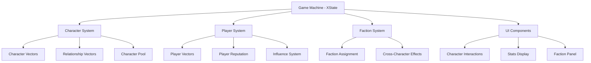

# Design Document

## Overview

The Harem Empire Game Improvements will transform the existing political intrigue game into a sophisticated, replayable experience with deep character relationships, faction dynamics, and emergent storytelling. The design consolidates the best features from both the legacy JavaScript implementation and the modern React/TypeScript version while adding new strategic depth.

The architecture leverages XState for predictable state management, maintains the existing vector-based character system, and introduces new political mechanics that create meaningful player choices and consequences.

## Architecture

### Core System Architecture



### State Machine Extensions

The existing game machine will be extended with new states and context properties:

```typescript
interface GameContext {
  // Existing properties
  playerType: PlayerType;
  rank: string;
  season: number;
  giftsRemaining: number;
  supportPoints: number;
  
  // New properties
  playerVector: PlayerVector;
  playerReputation: PlayerReputation;
  characters: Character[];
  factions: Faction[];
  suspiciousCharacters: string[];
  gameEvents: GameEvent[];
  seasonalEffects: SeasonalEffect[];
}
```

### Vector System Integration

The vector system from the legacy implementation will be fully integrated into the TypeScript codebase:

```typescript
interface CharacterVector {
  loyalty: number;      // 0-1, loyalty to empire
  ambition: number;     // 0-1, personal ambition
  influence: number;    // 0-1, political power
  suspicion: number;    // 0-1, suspicion of player
  fear: number;         // 0-1, fear level
}

interface RelationshipVector {
  trustInPlayer: number;      // 0-1, trust toward player
  loyaltyToPlayer: number;    // 0-1, loyalty to player
  fearOfPlayer: number;       // 0-1, fear of player
  dependenceOnPlayer: number; // 0-1, dependence on player
}

interface PlayerVector {
  loyalty: number;      // Player's loyalty to empire
  ambition: number;     // Player's ambition level
  influence: number;    // Player's political influence
  suspicion: number;    // How suspicious player appears
  fear: number;         // Player's fear level
}

interface PlayerReputation {
  perceivedLoyalty: number;    // How loyal others think player is
  perceivedThreat: number;     // How threatening player appears
  politicalSkill: number;      // Player's political competence
  trustworthiness: number;     // How trustworthy player appears
}
```

## Components and Interfaces

### Character System

#### Character Class Enhancement

```typescript
class Character {
  // Core properties
  id: string;
  name: string;
  type: 'major' | 'side' | 'minor';
  characterClass: string; // prince, minister, concubine, etc.
  
  // Vector systems
  vector: CharacterVector;
  relationshipVector: RelationshipVector;
  
  // Faction and status
  faction: FactionType | null;
  supportLevel: number;
  isAlive: boolean;
  lastGiftSeason: number;
  
  // Methods
  updateVector(changes: Partial<CharacterVector>): void;
  updateRelationshipVector(changes: Partial<RelationshipVector>): void;
  calculateSupportLevel(): number;
  getSuspicionThreshold(): number;
  getPersonalityHints(): string;
  getDetailedStats(): CharacterStats;
  canGiveGifts(): boolean;
  generateResponse(messageType: string, playerVector: PlayerVector): string;
}
```

#### Character Pool System

```typescript
interface CharacterPool {
  princes: CharacterTemplate[];
  ministers: CharacterTemplate[];
  concubines: CharacterTemplate[];
  maids: CharacterTemplate[];
  others: CharacterTemplate[];
}

interface CharacterTemplate {
  name: string;
  type: 'major' | 'side' | 'minor';
  characterClass: string;
  baseVector: CharacterVector;
  personalityTraits: string[];
  responseTemplates: ResponseTemplate[];
}

class CharacterGenerator {
  static generateCharacterSet(playerType: PlayerType): Character[];
  static selectWeightedCharacters(pool: CharacterPool, weights: CharacterWeights): Character[];
  static ensureMajorCharacter(characters: Character[]): Character[];
  static assignRandomVectors(character: Character): void;
}
```

### Faction System

#### Faction Management

```typescript
enum FactionType {
  REBEL = 'rebel',
  IMPERIAL = 'imperial', 
  LOYALIST = 'loyalist',
  NEUTRAL = 'neutral'
}

interface Faction {
  type: FactionType;
  members: string[]; // Character IDs
  influence: number;
  cohesion: number;
  playerMember: boolean;
}

class FactionManager {
  static assignCharacterToFaction(character: Character): FactionType;
  static calculateFactionEffects(factions: Faction[]): FactionEffect[];
  static processCrossCharacterEffects(action: PlayerAction, character: Character, allCharacters: Character[]): void;
  static offerFactionMembership(faction: Faction, playerSupport: number): boolean;
  static applyFactionBonuses(character: Character, faction: Faction): RelationshipModifier;
}
```

### Interaction System

#### Message System Enhancement

```typescript
interface MessageOption {
  text: string;
  type: 'ambitious' | 'loyal' | 'cautious' | 'neutral';
  keywords: string[];
  influenceRequired?: number;
  availabilityCheck?: (character: Character, player: PlayerVector) => boolean;
}

interface InteractionResult {
  vectorChanges: Partial<CharacterVector>;
  relationshipChanges: Partial<RelationshipVector>;
  responseType: string;
  responseText: string;
  crossCharacterEffects: CrossCharacterEffect[];
}

class InteractionEngine {
  static generateMessageOptions(character: Character, playerVector: PlayerVector): MessageOption[];
  static processMessageChoice(messageIndex: number, character: Character, player: PlayerVector): InteractionResult;
  static calculatePersonalityCompatibility(messageType: string, character: Character): number;
  static generateContextualResponse(character: Character, compatibility: number): string;
  static applyPlayerBonuses(result: InteractionResult, playerType: PlayerType): InteractionResult;
}
```

### Influence System

#### Power and Hierarchy Management

```typescript
interface InfluenceEffect {
  type: 'fear_cascade' | 'action_restriction' | 'deference' | 'access_denial';
  threshold: number;
  effect: (player: PlayerVector, character: Character) => void;
}

class InfluenceManager {
  static calculateInfluenceEffects(playerInfluence: number, characters: Character[]): InfluenceEffect[];
  static checkActionAvailability(action: string, playerInfluence: number, character: Character): boolean;
  static applyPromotionEffects(player: PlayerVector, characters: Character[]): void;
  static processInfluenceFearCascade(playerInfluence: number, characters: Character[]): void;
  static generateInfluenceTooltips(action: string, requirement: number): string;
}
```

## Data Models

### Game State Model

```typescript
interface GameState {
  // Core game state
  phase: 'character_selection' | 'playing' | 'emperor_encounter' | 'game_over';
  playerType: PlayerType;
  rank: string;
  season: number;
  
  // Resources
  giftsRemaining: number;
  supportPoints: number;
  
  // Political state
  playerVector: PlayerVector;
  playerReputation: PlayerReputation;
  characters: Character[];
  factions: Faction[];
  suspiciousCharacters: string[];
  
  // Game progression
  emperorAudienceCompleted: boolean;
  gameEndReason?: string;
  seasonalEvents: SeasonalEvent[];
}
```

### Character Relationship Model

```typescript
interface CharacterRelationship {
  characterId: string;
  supportLevel: number;
  relationshipVector: RelationshipVector;
  interactionHistory: InteractionRecord[];
  lastInteractionSeason: number;
  giftHistory: GiftRecord[];
}

interface InteractionRecord {
  season: number;
  messageType: string;
  responseType: string;
  vectorChanges: Partial<CharacterVector>;
  relationshipChanges: Partial<RelationshipVector>;
}
```

### Faction Model

```typescript
interface FactionState {
  type: FactionType;
  members: string[];
  playerMember: boolean;
  influence: number;
  cohesion: number;
  relationships: FactionRelationship[];
}

interface FactionRelationship {
  targetFaction: FactionType;
  relationship: 'allied' | 'neutral' | 'hostile';
  strength: number;
}
```

## Error Handling

### Vector Bounds Management

```typescript
class VectorManager {
  static clampVector(vector: CharacterVector): CharacterVector {
    return {
      loyalty: Math.max(0, Math.min(1, vector.loyalty)),
      ambition: Math.max(0, Math.min(1, vector.ambition)),
      influence: Math.max(0, Math.min(1, vector.influence)),
      suspicion: Math.max(0, Math.min(1, vector.suspicion)),
      fear: Math.max(0, Math.min(1, vector.fear))
    };
  }
  
  static validateVectorChanges(changes: Partial<CharacterVector>): boolean;
  static logVectorOverflow(characterId: string, vector: string, value: number): void;
}
```

### State Consistency Checks

```typescript
class StateValidator {
  static validateGameState(state: GameState): ValidationResult;
  static checkCharacterConsistency(characters: Character[]): ValidationResult;
  static validateFactionAssignments(factions: Faction[], characters: Character[]): ValidationResult;
  static repairInconsistentState(state: GameState): GameState;
}
```

### Graceful Degradation

```typescript
class ErrorRecovery {
  static handleCharacterGenerationFailure(playerType: PlayerType): Character[];
  static recoverFromInvalidVectorState(character: Character): Character;
  static fallbackToDefaultFactions(characters: Character[]): Faction[];
  static sanitizeCorruptedSaveData(saveData: any): GameState | null;
}
```

## Testing Strategy

### Manual UI Testing Approach

Following the project guidelines, all testing will be performed through manual UI interaction:

#### Core Functionality Tests
1. **Character Selection Flow**: Test each player type selection and verify proper initialization
2. **Interaction System**: Test all message types with different character personalities
3. **Vector Updates**: Verify character stats change appropriately after interactions
4. **Faction Dynamics**: Test faction formation and cross-character effects
5. **Influence Progression**: Test promotion effects and influence-based restrictions

#### Edge Case Testing
1. **Boundary Conditions**: Test vector values at 0, 1, and near boundaries
2. **Resource Depletion**: Test behavior when gifts reach 0
3. **Execution Scenarios**: Test suspicion thresholds and game over conditions
4. **Character Pool Limits**: Test with minimum and maximum character counts
5. **Faction Edge Cases**: Test single-member factions and faction switching

#### Integration Testing
1. **State Machine Transitions**: Verify all game state transitions work correctly
2. **Cross-System Effects**: Test how faction changes affect character relationships
3. **Seasonal Progression**: Test multi-season gameplay and character evolution
4. **Emperor Encounters**: Test various reputation/influence combinations
5. **Save/Load Consistency**: Test game state persistence across sessions

#### Performance Testing
1. **Large Character Sets**: Test with maximum character counts
2. **Complex Faction Networks**: Test with all factions having multiple members
3. **Extended Gameplay**: Test 20+ season games for performance degradation
4. **Rapid Interactions**: Test quick successive character interactions

### Test Documentation

Each test scenario will be documented with:
- **Setup**: Initial game state and character configuration
- **Actions**: Specific UI interactions to perform
- **Expected Results**: What should happen in the UI and game state
- **Verification**: How to confirm the test passed
- **Edge Cases**: Boundary conditions to check

### Regression Testing

Key areas requiring regression testing after changes:
- Character vector calculations
- Faction assignment logic
- Suspicion threshold mechanics
- Influence-based action restrictions
- Cross-character relationship effects

## Performance Considerations

### Vector Calculation Optimization

```typescript
class PerformanceOptimizer {
  // Batch vector updates to reduce recalculation overhead
  static batchVectorUpdates(updates: VectorUpdate[]): void;
  
  // Cache expensive calculations like faction effects
  static cacheCalculation<T>(key: string, calculator: () => T): T;
  
  // Debounce rapid UI updates during interactions
  static debounceUIUpdate(updateFunction: () => void, delay: number): void;
  
  // Lazy load character response templates
  static lazyLoadResponseTemplates(characterClass: string): Promise<ResponseTemplate[]>;
}
```

### Memory Management

- Character pools will be loaded on-demand rather than all at once
- Interaction history will be limited to last 10 interactions per character
- Unused character templates will be garbage collected after character generation
- Faction calculations will be memoized when character vectors haven't changed

### UI Performance

- Character stat displays will use React.memo to prevent unnecessary re-renders
- Vector animations will use CSS transforms for hardware acceleration
- Large character lists will implement virtual scrolling if needed
- Faction panel updates will be throttled to prevent excessive re-rendering

## Security Considerations

### Input Validation

```typescript
class InputValidator {
  static validateMessageChoice(messageIndex: number, availableOptions: MessageOption[]): boolean;
  static sanitizeCharacterName(name: string): string;
  static validateVectorInput(vector: Partial<CharacterVector>): boolean;
  static checkActionPermissions(action: string, playerState: PlayerVector): boolean;
}
```

### State Integrity

- All vector changes will be validated before application
- Character IDs will be UUIDs to prevent collision attacks
- Game state will be checksummed to detect tampering
- Faction assignments will be validated against character vectors

### Data Protection

- No sensitive user data will be stored in game state
- Character names will be sanitized to prevent XSS
- Save data will be validated before loading
- Error messages will not expose internal state details

## Deployment Strategy

### Development Phases

**Phase 1: Core Integration (Weeks 1-2)**
- Integrate vector systems into TypeScript codebase
- Implement enhanced character interaction system
- Add basic faction assignment logic

**Phase 2: Political Mechanics (Weeks 3-4)**
- Implement suspicion and execution system
- Add influence-based action restrictions
- Create cross-character relationship effects

**Phase 3: Advanced Features (Weeks 5-6)**
- Implement random character assignment
- Add gift reward system
- Create enhanced emperor encounter system

**Phase 4: Polish and Optimization (Weeks 7-8)**
- Implement advanced UI features
- Add seasonal progression mechanics
- Optimize performance and fix bugs

### Rollback Strategy

- Each phase will maintain backward compatibility with existing save data
- Feature flags will allow disabling new mechanics if issues arise
- Database migrations will be reversible
- UI changes will gracefully degrade for older browsers

### Monitoring and Metrics

- Track average game session length
- Monitor character interaction patterns
- Measure faction formation success rates
- Log performance metrics for vector calculations
- Track user engagement with new features